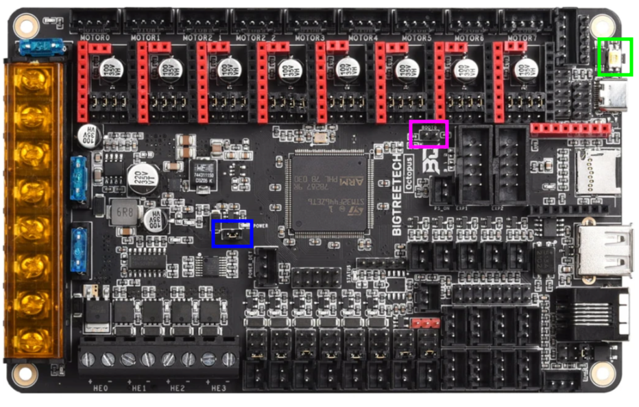
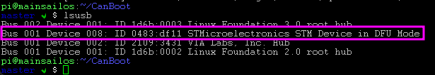
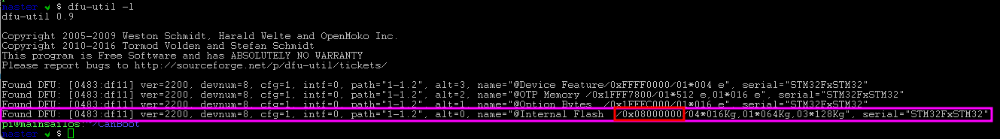
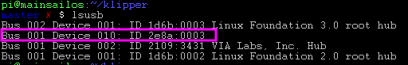
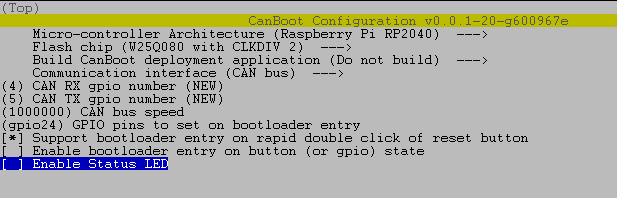
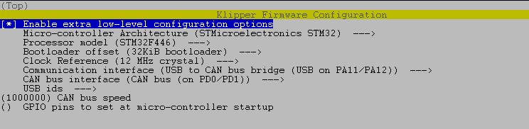
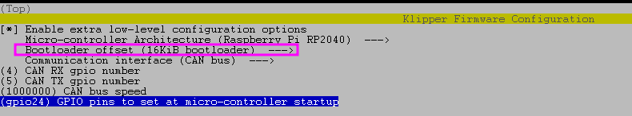

# voron_canbus_octopus_sb2040

## Prerequist

### Software
- python3
- pip3

```
apt update
apt upgrade
apt install python3 python3-pip python3-can
pip3 install pyserial
```
### Hardware
- raspberry pi
- BTT octopus 1.1
- Mellow SB2040


## CanBoot

### Cloning repo

```
sudo su pi
cd ~
git clone https://github.com/Arksine/CanBoot
```

### Create images

#### CanBoot for octopus 1.1

We will configure the firmware
```
cd ~/CanBoot
make menuconfig
```


> For F446 processor => `STM32F446` and `12 Mhz`

And compile it
```
make
```

```
mkdir ~/firmware
mv ~/CanBoot/out/canboot.bin ~/firmware/octopus_1.1_canboot.bin
```


### Flashing images

#### CanBoot for octopus 1.1

Set your octopus 1.1 board to DFU. To do that, remove the blue jumper and put it on the purple jumper (blue is power over usb and purple is boot mode).


Once done power the board, wait a few second then hit the green button once. The board should boot in DFU mode.

To confirm that you can simple do a `lsubs`



When the board is properly in DFU you will need to get some info on it.

```
dfu-util -l
```


> Note the address of *Internal Flash* => 0x08000000
>
> Note the address of the usb device => 0483:df11

We will now procede to flash the bootloader of the board to canboot

```
sudo dfu-util -a 0 -D ~/firmware/octopus_1.1_canboot.bin --dfuse-address 0x08000000:force:mass-erase:leave -d 0483:df11
```

The board should now be flash with a canboot bootloader.

**/!\\/!\\/!\\  You can now remove the purple jumper. /!\\/!\\/!\\**

#### CanBoot for sb2040

Set your sb2040 board to DFU. To do that, remove any power to the board, press the boot button while connecting the board to USB.
The board should now be in DFU.

To confirm that you can simple do a `lsubs`




We will configure the firmware
```
cd ~/CanBoot
make menuconfig
```


And compile it
```
make -j 4
```

```
sudo make flash FLASH_DEVICE=2e8a:0003
```


## CAN Network

We need to create the can0 interface for been able to flash the sb2040 over CAN.

```
sudo nano /etc/network/interfaces.d/can0
```

```
allow-hotplug can0
iface can0 can static
  bitrate 1000000
  up ifconfig $IFACE txqueuelen 128
```

Power off/on everything

> check for network
```
ip a
```
```
can0: <NOARP,UP,LOWER_UP,ECHO> mtu 16 qdisc pfifo_fast state UP group default qlen 128
link/can
```

> Check for more details
```
ip -details -statistics link show can0
```
```
can0: <NOARP,UP,LOWER_UP,ECHO> mtu 16 qdisc pfifo_fast state UP mode DEFAULT group default qlen 128
link/can  promiscuity 0 minmtu 0 maxmtu 0
can state ERROR-ACTIVE restart-ms 0
        bitrate 1000000 sample-point 0.750
        tq 62 prop-seg 5 phase-seg1 6 phase-seg2 4 sjw 1
        gs_usb: tseg1 1..16 tseg2 1..8 sjw 1..4 brp 1..1024 brp-inc 1
        clock 48000000
        re-started bus-errors arbit-lost error-warn error-pass bus-off
        0          0          0          0          0          0         numtxqueues 1 numrxqueues 1 gso_max_size 65536 gso_max_segs 65535
RX: bytes  packets  errors  dropped overrun mcast
11412      1551     0       0       0       0
TX: bytes  packets  errors  dropped carrier collsns
3568       641      0       0       0       0
```


## Klipper with CAN

### Create images

#### Klipper for octopus 1.1

We will configure the firmware
```
cd ~/klipper
make menuconfig
```


And compile it
```
make
```

```
mv ~/klipper/out/klipper.bin ~/firmware/octopus_1.1_klipper.bin
```

#### Klipper for sb2040

We will configure the firmware
```
cd ~/klipper
make menuconfig
```


And compile it
```
make
```

```
mv ~/klipper/out/klipper.bin ~/firmware/sb2040_1.0_klipper.bin
```


### Flashing images

#### Klipper for octopus 1.1

```
ls -al /dev/serial/by-id
```
> Note the serial of the octopus 1.1 board

```
cd ~/CanBoot/scripts
pip3 install pyserial
python3 flash_can.py -f ~/firmware/octopus_1.1_klipper.bin -d /dev/serial/by-id/usb-CanBoot_stm32f446xx_170038000650314D35323820-if00
```

The board should now be flash with a klipper can bridge.

> If this part doesn't work or you don't manage to see the board as an USB device, refer to [Useful tricks](###-Useful-tricks-to-be-able-to-update-an-octopus-1.1-in-`USB-to-Can-Bridge`)

#### Klipper for sb2040

```
cd ~/CanBoot/scripts
python3 flash_can.py -i can0 -q
```
```
Resetting all bootloader node IDs...
Checking for canboot nodes...
Detected UUID: c2ecdf459ba5, Application: Klipper
Detected UUID: 685d07717632, Application: Klipper
Query Complete
```

> Note the two serial UUID
>
> To differentiate which uuid correspond to which board, you can plug only one board and get it's serial UUID

```
python3 flash_can.py -i can0 -u SERIAL_UUID -f ~/firmware/sb2040_1.0_klipper.bin
```

The board should now be flash with a klipper can.


## Klipper config

### Retrieve serial UUID of can device

```
cd ~/CanBoot/scripts
python3 flash_can.py -i can0 -q
```
```
Resetting all bootloader node IDs...
Checking for canboot nodes...
Detected UUID: c2ecdf459ba5, Application: Klipper
Detected UUID: 685d07717632, Application: Klipper
Query Complete
```

> Note the two serial UUID
>
> To differentiate which uuid correspond to which board, you can plug only one board and get it's serial UUID


### Klipper config

Klipper configuration example

```
[mcu]
canbus_uuid: c2ecdf459ba5

[mcu sb2040]
canbus_uuid: 685d07717632

...

[temperature_fan exhaust_fan]
...
sensor_pin: sb2040:gpio26

[temperature_sensor toolhead]
sensor_type: temperature_mcu
sensor_mcu: sb2040
min_temp: 0
max_temp: 100
```

## Useful tools

```
apt install can-utils
```

```
canbusload can0@1000000
```
```
candump -d -e can0 -H -t a
```

## Useful commands

> List CAN devices
```
cd ~/CanBoot/scripts
python3 flash_can.py -i can0 -q
```

> Flash over can0 interface
```
python3 flash_can.py -i can0 -u d0548cb2fa73 -f ~/firmware/octopus_1.1_klipper.bin
```

> Flash over serial usb
```
python3 flash_can.py -d /dev/serial/by-id/usb-CanBoot_stm32f446xx_4A0021000651303431333234-if00 -f ~/firmware/octopus_1.1_klipper.bin
```

> can0 interface information
```
ip -details -statistics link show can0
```

## Update klipper on the Octopus

### Useful tricks to be able to update an octopus 1.1 in `USB to Can Bridge`

First thing you need to know is that you cannot update klipper on the octopus 1.1 over CAN.
The reason is because the bord is actually running the CAN interface in bridge mode. When you use the tool to ask an UUID CAN device to be flashed, the board restart on the canboot bootloader to accept further command (flashing klipper). By restarting the CAN interface (can0) is actually killed as the board running the bridge is shotdown and restarted in canboot bootloader.

The flash sequence cannot complet this way !

### How to flash then ?!

Since the board restarted on the canboot bootloader, the board is actually available as a serial usb device !
You can now flash klipper directly using the serial usb.

### Commands

First you need to put your printer in emmergency stop. As soon as the printer is in emmergency you will need to restart the firmware AND immediatly stop klipper (killing klipper process quickly is very important as the board will boot on canboot then immediatly boot on klipper).


> Put the board in emmergency stop, restart the firmware and kill klipper

```
systemctl stop klipper
```


> If you manage to kill fast enough klipper, you should been able to see the CAN device.
```
cd ~/CanBoot/scripts
python3 flash_can.py -i can0 -q
```

> Trigger the board to restart on canboot bootloader
```
python3 flash_can.py -i can0 -u d0548cb2fa73 -f ~/firmware/octopus_1.1_klipper.bin
```

> You should now see the board as an serial usb device
```
ll /dev/serial/by-id
```

> Flash klipper to the board over serial usb
```
python3 flash_can.py -d /dev/serial/by-id/usb-CanBoot_stm32f446xx_4A0021000651303431333234-if00 -f ~/firmware/octopus_1.1_klipper.bin
```

Your board is now updated. You can restart everything.
